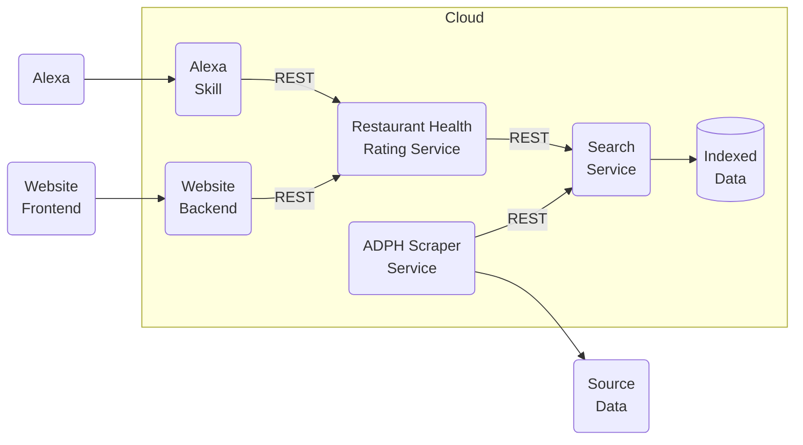

# HuntsvilleFood

## System Design

```mermaid

flowchart LR

  alexa(Alexa)
  websiteFrontend(Website\nFrontend)

  subgraph cloud[Cloud]
    alexaSkill(Alexa\nSkill)
    websiteBackend(Website\nBackend)
    
    healthRatingService(Restaurant Health\nRating Service)
    
    searchService(Search\nService)
    scraperService(ADPH Scraper\nService)
    
    alexaSkill --REST--> healthRatingService
    websiteBackend --REST--> healthRatingService
    
    searchService --> searchDatabase[(Indexed\nData)]
    
    scraperService --REST--> searchService
    
    healthRatingService --REST--> searchService
    
  end
  
  sourceData(Source\nData)

  websiteFrontend --> websiteBackend
  alexa --> alexaSkill
  
  scraperService --> sourceData
```
